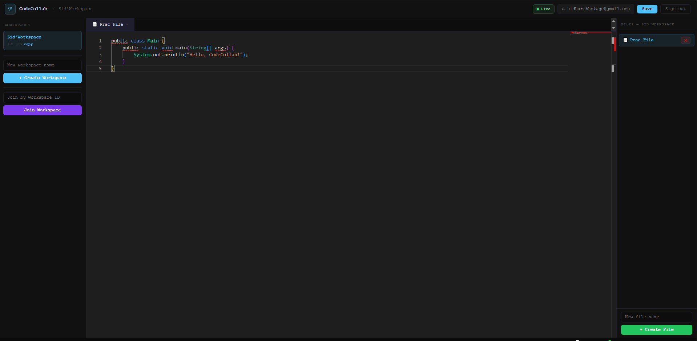
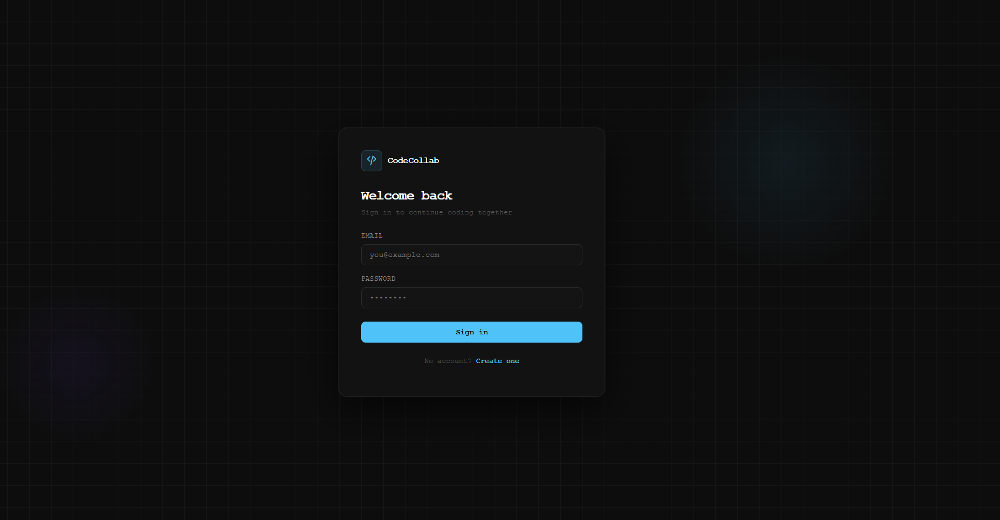

# CodeCollab — Real-Time Collaborative Coding Platform

> Two developers. One editor. Zero lag.

**[▶ Watch Demo]([YOUR_LOOM_LINK](https://www.loom.com/share/d6df28a87388482893234e21248011c1))** · **[Live app](https://sidharthnair-dev.netlify.app/)**

Try it instantly using demo credentials:
- Email: `demo@codecollab.com`
- Password: `Demo1234!`
---


## What it does

CodeCollab lets multiple developers write and edit code together in real time — like Google Docs, but for code. Changes propagate in under 100ms. Every workspace is JWT-secured and fully isolated from other tenants.

Deployed and actively tested in real-time multi-user sessions. Supports multiple users editing the same workspace with sub-100ms sync. Not a tutorial project.

---

## Architecture

```
React + Monaco Editor
        │
        ├── REST (auth, workspaces, files) ──► Spring Boot + Spring Security
        │                                              │
        └── WebSocket (STOMP)  ────────────────────────┤
                                                       │
                                              PostgreSQL (Neon)
                                         multi-tenant schema

Deployed: Docker → GitHub Actions CI/CD → AWS EC2
Frontend: Netlify · DB: Neon PostgreSQL
```
---

## Technical decisions worth noting

**Why STOMP over raw WebSockets?**
STOMP gives topic-based routing out of the box — each workspace subscribes to its own channel (`/topic/workspace/{id}`). Raw WebSockets would have required building that routing layer manually.

**How concurrent edits are handled**
Each edit event carries a timestamp and user ID. The backend processes events sequentially per workspace session — last acknowledged write wins. Intentionally simple: optimistic UI with server reconciliation avoids OT/CRDT complexity while keeping perceived latency near zero.

**Multi-tenant data isolation**
Every workspace, file, and user record is scoped by `tenant_id` at the schema level. No workspace can query another tenant's data — enforced at the repository layer, not just the API layer.

**JWT + Spring Security**
Stateless auth. Tokens are validated on every request, including the WebSocket handshake upgrade. No session state on the server.

**What I'd do differently at scale**
At higher concurrency I'd move WebSocket state to Redis pub/sub so multiple backend instances can share session state. The current single-instance model is a known limitation I'd address with horizontal scaling.

---

## Tech stack

| Layer | Technology |
|---|---|
| Backend | Java 21, Spring Boot, Spring Security |
| Auth | JWT (stateless) |
| Real-time | WebSockets (STOMP protocol) |
| Frontend | React, Monaco Editor |
| Database | PostgreSQL (Neon) |
| DevOps | Docker, GitHub Actions, AWS EC2 |
| Hosting | Netlify (frontend), Render (fallback) |

---

## Screenshots




---

## Run locally

```bash
git clone https://github.com/sidharthnair7/code-collab-platform
cd code-collab-platform

# Backend
./mvnw spring-boot:run

# Frontend (separate terminal)
cd frontend
npm install && npm run dev
```

Requires: Java 17+, Node.js, PostgreSQL or a Neon connection string.

---

## Contact

Built by **Sidharth Nair** — final-year CS student at Trent University, backend-focused developer based in Canada.

[LinkedIn](https://www.linkedin.com/in/sidharthnair7/) · [Email](mailto:realsid6@gmail.com)
